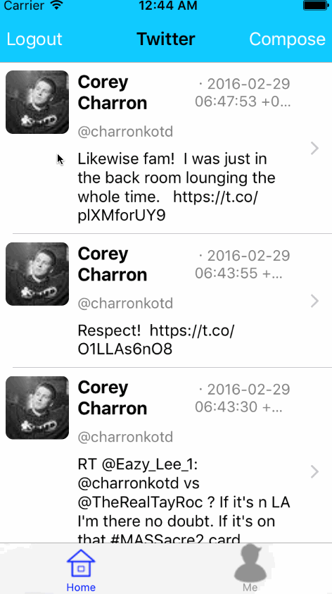

# Old Swift Projects

## These projects were created during Codepath iOS University

 #### **Billulator**(original pushed date: 12/31/2015)
 #### **ReelCheck**(original pushed date: 02/09/2016)
 #### **AirUiOSed**(original pushed date: 02/14/2016)
 #### **ReelCheckV2**(original pushed date: 02/16/2016)
 #### **YelpApp**(original pushed date: 02/19/2016)
 #### **Twitter**(original pushed date: 02/29/2016)

 ## General Summary/Outline of what I learned
* Git
* Swift
* XCode StoryBoard
* (Google Maps, Yelp, Twitter, imdb)APIs
* oAuth
* CocoaPods and Carthage

#### Much of the Code may be deprecated due to it being couple years old and swift goes through iterations every couple months. (Possible version: swift 1.2)

## Project Summaries

**Billulator**

This was my very first Swift application and this application happened to also be my very first project that I had pushed onto github by myself. This application is a calculator that calculates how much you will be billed depending on the tip. I learned about Git, Swift Syntax and the click and drag using story board.

**ReelCheck**

This application was designed to show new movies released from the imdb database. The application features a top rated section and a Now Playing section(implemented first iteration). During this process I learned to use multiple view controllers. I learned to use tables and custom cells. I had learned to use libraries with cocoapods such as AFNetworking. I also learned how to use navigation controller and scroll views. I also learned how use JSON data to display information on a iOS application.

**YelpApp**

This application pulls Thai food resturants from Yelp API and displays it. Ratings and information about the place specifically mentioning Thai food. I managed to use autolayout for the first time.

**Twitter**

This application was developed to imitate the Twitter App using Twitter API. Through the process I have learned about Networking and Authencation(OAuth) for the first time.